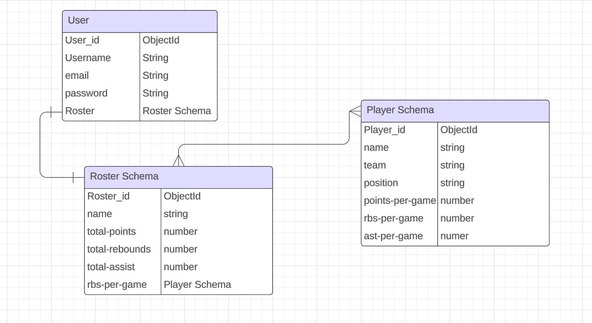

# Unit Two Project Proposal 

## It's In The Game

## Project Description
- It’s in the Game is an interactive application designed for NBA enthusiasts to explore and build their fantasy basketball teams. Users can search through a comprehensive list of NBA players, view details such as their names, teams, positions, and stats, and add their selected players to a personal fantasy roster. The app provides a dynamic and engaging platform for fans to create, manage, and optimize their own fantasy basketball teams.

## Wire Frames

## User Stories 
#### MVP Goals 
- As a user, I want to view a list of all NBA players.
- As a user, I want to be able to create a roster of 5 players (search for players). 
- As a user, I want to add a new player(name, team, position, and stats) to my roster so that I can keep track of my fantasy team.
- As a user, I want to be able to edit/update my roster.
- As a user, I want to be able to delete a player from my roster/team.
- As a user, I want to be able to track the total stats of my roster.

### Stretch Goals
- Include functionality to search for International Players
- Image upload of players
- Invite other users to It's in the Game for fantasy play. 
- Live stats for players

## ERD

## Routing Table

## To-Do-List
[Project Management Notion Link](https://factual-birth-40e.notion.site/To-Do-List-IT-S-IN-THE-GAME-c7b348514d18434693b974df153f52dc)

## Timeline-Daily Accountability

| Day       	| Task                          	| Blockers 	| Notes/Thoughts 	|
|-----------	|-------------------------------	|----------	|----------------	|
| Sunday    	| Setup & Initialization        	|          	|                	|
| Monday    	| Models & Database Setup       	|          	|                	|
| Tuesday   	| Auth Setup                    	|          	|                	|
| Wednesday 	| Controllers & Routes          	|          	|                	|
| Thursday  	| Views & Templates             	|          	|                	|
| Friday    	| Styling User Interface        	|          	|                	|
| Saturday  	| Functionality & Final Touches 	|          	|                	|
| Sunday    	| Dive into stretch goals       	|          	|                	|
| Notes     	| Commit Changes Regularly!!!!  	|          	|                	|
| Monday    	| Presentation Day              	|          	|                	|